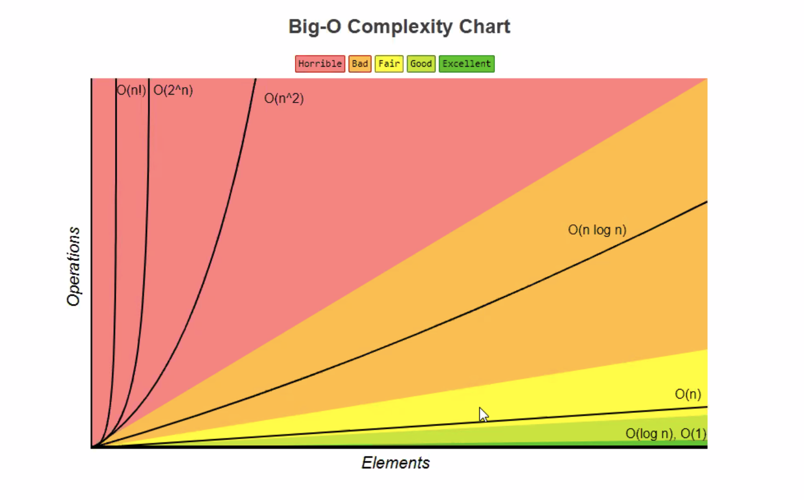

# Time Complexity (bigcheatsheet.com)

- time is based on the complexity of the algorithm vs the real world time because of computing power etc


## Linear Search
- Linear search -> linear runtime O(n)

[0, 7, 4, 2, 9, 3, 12]
looking for a 2, searches a data structure linearly to fulfill a search query
- return idx?
- if you look for another number, you will have to start the search again.

## Binary Search
```
def find_value_binary(arr, value):
    first = 0

    last = (len(arr) - 1)

    found = False

    while first <= and not found:
        # find the middle of the data
        middle = (first + last) // 2

        if arr[middle] == value:
            found = True

        else:
            # Left case
            if value < arr[middle]:
                last = middle - 1
            else:
                # Right case
                # search the upper half
                first = middle + 1

    return found

```
        S           S -> E
nums = [1, 2, 3, 5, |7, 9| ]
- breaks the array in half and searches from both ends

## Linear vs Binary
```
print("Linear")
start = time.time()
print(linear_search(my_random, searching_for))
end = time.time()
print(f"Runtime: {end - start}")

print("Binary")
start = time.time()
my_random.sort()
print(find_value_binary(my_random, searching_for))
end = time.time()
print(f"Runtime: {end - start}")


lets see what heppens with multiple runs

print("Linear")
start = time.time()
print(linear_search(my_random, searching_for))
end = time.time()
print(f"Runtime: {end - start}")

print("Linear Again")
start = time.time()
print(linear_search(my_random, searching_for))
end = time.time()
print(f"Runtime: {end - start}")

print("Binary")
start = time.time()
my_random.sort()
print(find_value_binary(my_random, searching_for))
end = time.time()
print(f"Runtime: {end - start}")

print("Binary _after_ sort")
start = time.time()
print(find_value_binary(my_random, searching_for))
end = time.time()
print(f"Runtime: {end - start}")
```
```
[5, 51, 82, 37, 68, 22, 85, 61, 2, 97, 56, 91, 46, 48, 11, 96, 9, 58, 69, 64, 45, 6, 7, 81, 29, 70, 14, 4, 0, 15, 62, 40, 52, 71, 78, 74, 75, 94, 86, 44, 32, 63, 24, 83, 80, 23, 49, 31, 98, 99, 87, 67, 30, 41, 34, 50, 19, 25, 73, 33, 92, 16, 36, 18, 57, 95, 8, 21, 79, 77, 17, 1, 84, 47, 60, 13, 93, 42, 27, 35, 12, 90, 20, 65, 88, 3, 55, 38, 53, 72, 28, 26, 66, 39, 43, 89, 10, 76, 54, 59]
**Linear**
True
Runtime: .000015974044799804688
**Binary**
True
Runtime: .00020313262939453125
**Linear**
True
Runtime: .000010967254638671875
**Linear Again**
True
Runtime: .000009059906005859375
**Binary**
True
Runtime: .000010967254638671875
**Binary _after_ sort**
True
Runtime: .00004076957702636719
```

## Sorting Data
(visualgo.net/bn/sorting)


## Insertion Sort